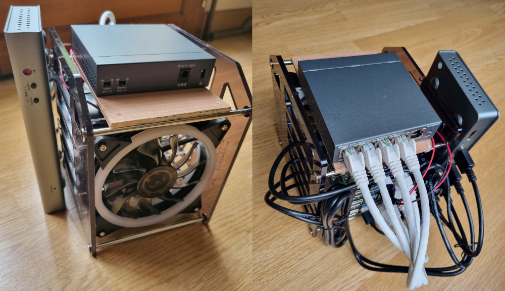
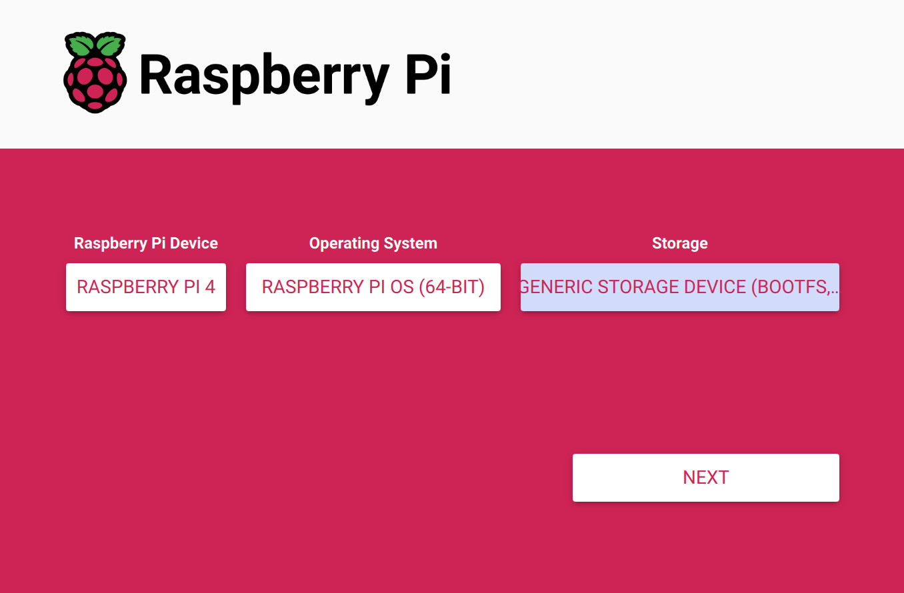
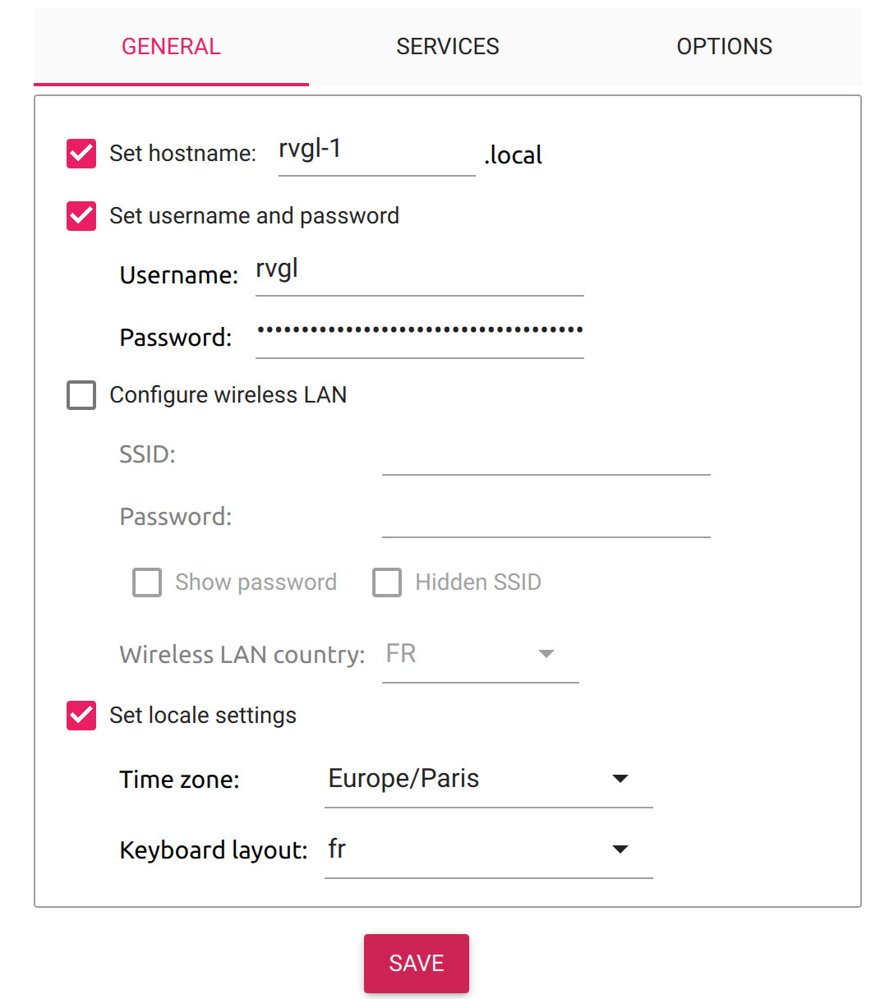
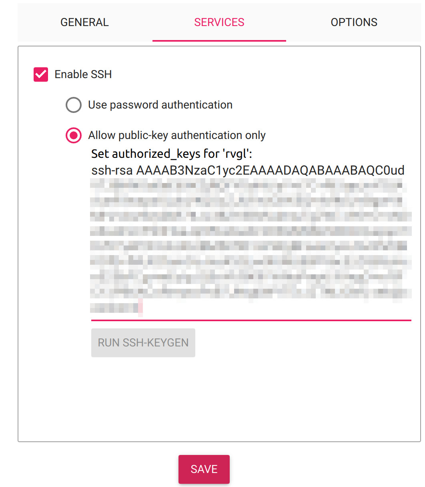

https://youtu.be/NhlU563p5lg
# rvgl-rpi-cluster
Setup 4x RaspberryPi 4 in cluster to play rvgl (Re-Volt) on a single display and play in network mode


## Hardware
### Bill of Materials
- 4x Raspberry Pi 4 (1Gb, 2Gb or 4Gb of Ram)
- 4x Raspberry Pi PoE+ HAT
- 4x Micro SDCard (Minimum 16Gb of mem)
- 4x Micro HDMI to HDMI Cables
- 1x HDMI Quad Viewer
- 1x HDMI cable
- 1x Ethernet Switch PoE with at least 5 ports
- 4x Ethernet short cables
- 1x Ethernet long cable
- 4x GamePad (Xbox Wireless Controller for example)

### Connecting everything together

## Software

### Install Rapsberry Pi OS
On a Linux machine prepare the SDCards thanks to Raspberr Pi Imager.
Install the Raspberry Pi OS 64bit, click on edit settings
- General
    - Hostname: rgvl-1,rvgl-2,rvgl-3,rvgl-4 (depending of the RPi you are installing)
    - Username: rvgl
    - Password: The password you want
    - Local: configure your local settings
- Services
    - enable ssh
    - provide your public key





Repeat these steps for the 4 SDCards, don't forget to change hostnames.

### Customize images
On a linux machine verify that you can access to RPi thanks to ssh.
```
ssh rvgl@rvgl-1.local
```
Repeat it for all RPi

Update Raspberry pi OS:
```
./execute_on_cluster.sh update
```

Install packages needed by rvgl:
```
./execute_on_cluster.sh packages_to_install
```

Setup you language by modifying the file (default is French)
```
to-deploy/rvgl/profiles/vas0sky/profile.ini
```

Install remote files:
```
./deploy_files_on_cluster.sh
```

Change background images to RVGL + Number:
```
./execute_on_cluster.sh background_number
```

Configure Bluetooth devices on each cluster member
```
ssh rvgl@rvgl-1.local
bluetoothctl
scan on
scan off
pair BT_ADDRESS
trust BT_ADDRESS
connect BT_ADDRESS
```

Install RVGL Launcher on your linux machine
https://rvgl.org/downloads/rvgl_launcher_linux.zip


Deploy rvgl on the cluster:
```
./deploy_rvgl_from_local.sh
```

Activate Autostart:
```
./execute_on_cluster.sh activate_autostart
```

Audio HDMI:
```
amixer cset numid=3 2
```
# TODO
- configure audio output to hdmi

# Troubleshooting
## Unpair a Bluetooth joypad:
```
ssh rvgl@rvgl-1.local
bluetoothctl
cancel-pairing BT_ADDRESS
remove BT_ADDRESS
```

## Xbox Wireless Controller not working
Please update your firmware on a Windows machine thanks to [Xbox accessories](https://apps.microsoft.com/detail/9nblggh30xj3)


# Links:
- https://www.speedrun.com/it-IT/revolt/resources
- https://forums.raspberrypi.com/viewtopic.php?t=271009


- update firmware rpi-update
- raspi-config Advances A6 Waylmand, W1 X11


| Resolution | Min FPS | Max FPS |
|------------|---------|---------|
|  1920x1080 |     35  |  49     |
|  1680x1050 |     44  |  56     |
|  1600x1000 |     49  |  60     |
|  1440x900  |     60  |  60     |